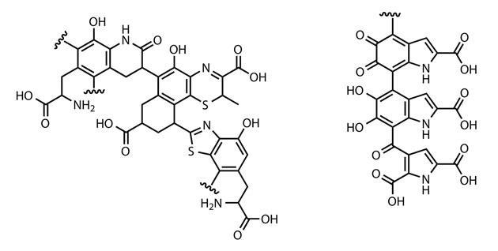
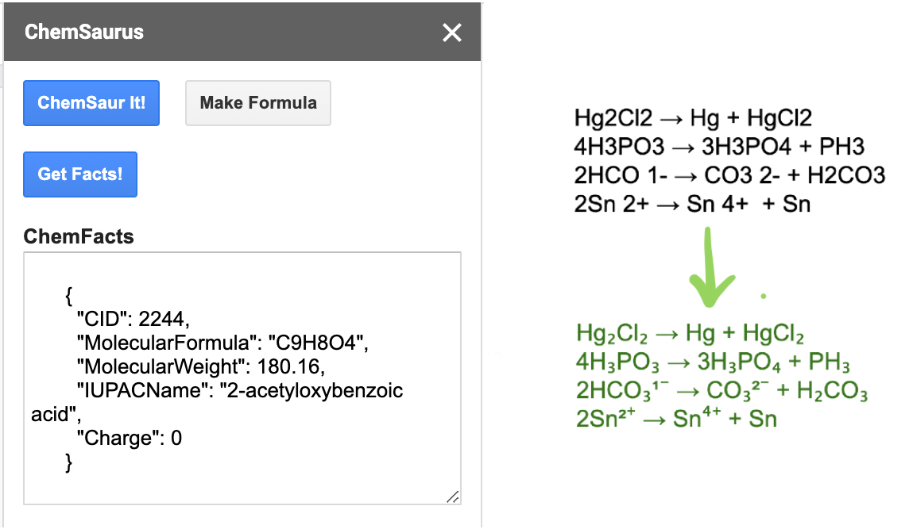

# ChemSaurus

A Google Docs add-on for fast chemical formatting, smart molecular substitution, and more, ChemSaurus is designed to make publishing painless. 

 

Created at [DevFest 2020](https://devfe.st/) at Columbia University by Josh Fuller, Omar Khan, and Emily Wang.

## Project Overview
### Motivation
When writing chemistry in Google Docs, the process of making formulas, reaction diagrams, and names look presentable is tedious and requires using the internet to get chemical properties and behaviors and check for proper nomenclature conventions. As such, we wanted to streamline this process by clustering relevant solutions for the aforementioned issues into one robust product.

### Description
ChemSaurus allows you to dynamically convert text in Google Docs files into automatically-generated formats in accordance with reaction structure convention and current International Union of Pure and Applied Chemistry (IUPAC) naming standards. In addition to standard stylization edits (subscripting numbers indicating repeat atoms, superscripting those that indicate ionic charge, etc.), ChemSaurus also provides potential alternative representations of the input chemical, as well as replacement suggestions based on molecules with similar representations and/or attributes.

 

## Implementation
We set up ChemSaurus as a [Google Docs Add-On](https://developers.google.com/gsuite/add-ons/overview), writing the logic in Google's own all-purpose Docs language [Apps Script](https://developers.google.com/apps-script). The add-on selects a word to analyze based on the position of the user's cursor, and automatically provides a properly-scripted form of the chemical formula through an internal method. The smart replacements are then obtained through a [PubChem API](https://pubchemdocs.ncbi.nlm.nih.gov/autocomplete) and shown in a menu on the Docs sidebar, which itself was created in HTML. The Docs file is then modified based on whichever alteration the user selects, if any. 

### List of Technologies Used
Apps Script, PubChem API, JavaScript, HTML

## Future Vision
* Deepen the smart suggestions' ability to provide more relevant and insightful recommendations for formatting alternatives and disparate suggestions.

* Implement a caching tool to keep track of the frequency of common chemical substitutions, improving the speed of the ChemSaurus program as well as providing a facile route for the user to repeatedly mention a molecule, a common circumstance in a chemical report.

## Appreciation
We'd like to thank Columbia University and its Applicaton Development Initiative (ADI) for hosting DevFest 2020, as well as the sponsors of DevFest for continuously providing their products and support throughout the hackathon. 
